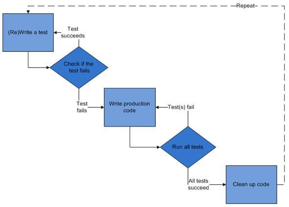

# SPRING BOOT TESTING

Este proyecto es similar al repositorio de **JAVA-SE** solo que con spring orientado el testing

## Niveles de abstraccion en el testing de software

* Pruebas unitarias son las pruebas más bajas en el nivel de abstracción, ya que se enfocan en verificar que una pequeña unidad de código, como una función o un método, funciona correctamente.

* Pruebas de integración son un nivel de abstracción más alto que las pruebas unitarias, ya que se enfocan en verificar la interacción y la comunicación entre diferentes componentes o módulos de la aplicación.

* Pruebas de aceptación son el nivel más alto de abstracción, ya que se enfocan en verificar que la aplicación cumple con los escenarios de usuario y el comportamiento esperado desde el punto de vista del usuario.

## TDD

Desarrollo guiado por el Test, es un enfoque de desarrollo de software en el cual los desarrolladores escriben pruebas antes de escribir codigo para su aplicacion. Esto con la finalidad asegurarse que el codigo cumple con los requisitos y no tiene errores.

**Pasos**:  

* Escribir una prueba que falle
* Escribir el codigo necesario para que la prueba pase
* Refactorizar el codigo para asegurarse que sigue siendo limpio y mantenible

## BDD

Desarrollo guiado por el Comportamiento práctica derivada del TDD, con un enfoque de trabajo colaborativo en cual los **desarrolladores**, los **probadores**, y los **stakeholders** trabajan juntos para entender y describir el comportamiento esperado de la aplicacion. Se utiliza un lenguaje comun (Lenguaje natural y facil de entender) con un enfoca en los escenarios de usuario para guiar el desarrollo del software. El objetivo es desarrollar software de alta calidad y facil de entender para todas las partes involucradas.

**Pasos**:  

* Definir el comportamiento esperado: En este paso, se trabaja con los stakeholders para entender y describir el comportamiento esperado de la aplicación en términos de escenarios de usuario.
* Escribir pruebas de aceptación: Una vez que se tiene una comprensión clara del comportamiento esperado, se escriben pruebas de aceptación que verifican que la aplicación cumple con estos escenarios.
* Desarrollar el código: A partir de las pruebas de aceptación, se desarrolla el código necesario para cumplir con el comportamiento esperado.
* Ejecutar las pruebas: Se ejecutan las pruebas de aceptación para verificar que el código cumple con el comportamiento esperado.
* Refactorizar del código: Si se necesita, se refactoriza el código para asegurar que sigue siendo limpio y mantenible.
* Repetir: este proceso se repite hasta que se cumplan todos los escenarios de usuario.

El lenguaje usado para BDD es Gherkin. Gherkin es un lenguaje fácil de usar ya que es similar al lenguaje natural de las personas. Es posible utilizarlo para la realización de pruebas como para escribir historias de escenarios de usuarios.  
Un ejemplo explicativo basico seria:  

* Given: Dado que me estoy registrando para una prueba gratuita (Contexto)
* When: Cuando envío los detalles requeridos (Sucede una acción)
* Then: Entonces recibo un enlace a la descarga. (Resultados)
